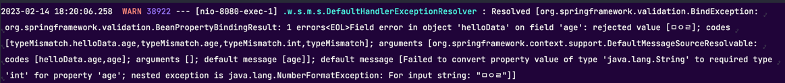

<div align="center">
    <h2>스프링 MVC 1편 - 기본기능 및 실습</h2>
</div>

#### 로깅 간단히 알아보기
- 실무에서는 sout을 사용하지 않고 별도의 로깅 라이브러리를 사용한다.

- 로깅 라이브러리
  - 스프링 부트 라이브러리를 사용하면 스프링 부트 로깅 라이브러리(`sping-boot-starter-logging`)가 함께 포함된다.
  - 이 라이브러리는 기본으로 다음 로깅 라이브러리를 사용한다.
    - SLF4J : 인터페이스
    - Logback :  그 구현체로 Logback을 사용한다.

#### @RestControlelr vs @Controller
- RestController : 컨트롤러에서 문자열을 반환하면 해당 문자열을 HTTP 메시지 바디에 바로 입력한다.
  - `@ResponseBody`와 관련이 있다.
- Controller : 컨트롤러에서 문자열을 반환하면 해당 문자열을 이름으로 갖는 view를 찾아서 view가 렌더링된다.

#### log의 장점
- 로그의 레벨을 지정할 수 있다.


- 프로세스 id, 스레드 id 부터 클래스명 등 많은 내용을 볼 수 있다.
`2023-02-11 21:32:33.308  INFO 20728 --- [nio-8080-exec-1] hello.springmvc.basic.LogTestController  :  info log=spring`
- 로그를 콘솔에 출력도 할 수 있고 `파일`로도 기록을 남길 수 있다.
- sout보다 성능이 좋다(내부 버퍼링, 멀티 쓰레드 등), 로그는 성능이 극한으로 설정되어 있다.
- 모든 로그를 보고 싶은 경우
  - `application.properties`에 로그 레벨을 지정하면 된다.
  - 로그 레벨은 아래와 같은 순서, 상위 등급으로 설정할 수록 하위 등급 로그를 더 볼 수 있다.
  - LEVEL: TRACE > DEBUG > INFO > WARN > ERROR 
  ```groovy
  log.trace("trace log={}", name);
  log.debug("debug log={}", name);  // 현재 로그는 디버그 할 때 보는거야(개발 서버)
  log.info("info log={}", name);  // 운영 시스템에서도 봐야할 중요한 정보
  log.warn("warn log={}", name);  // 경고
  log.error("error log={}", name);
  ```
- 로그 레벨 설정
```groovy
#전체 로그 레벨 설정(기본 info) 
logging.level.root=info

#hello.springmvc 패키지와 그 하위 로그 레벨 설정 
logging.level.hello.springmvc=debug
```
- 운영서버와 개발서버에서 로그의 레벨을 다르게 설정해서 사용을 한다.
  - 설정만으로 로그 출력 모양을 조절할 수 있다는 점도 장점이다. 
  - 그렇게 안하고 sout을 사용하여 출력을 시킨다면 이런 설정이 불가능하다.
  - 개발 서버는 debug 출력
  - 운영 서버는 info 출력
- 올바른 로그 사용법
  - `log.debug("data="+data`
  - 로그 출력 레벨을 info로 하더라도 해당 문자열을 합치는 연산이 발생한다.
  - 즉 출력을 하지도 않는데 문자열을 합치는 연산이 일어나서 메모리가 낭비되는 것이 문제점이다.
  - 따라서 이는 사용은 가능하지만 절대 사용하면 안되는 방법이다.

#### HTTP 요청 - 기본, 헤더 조회
- HttpServletResponse
- HttpMethod : HTTP 메서드를 조회한다. 
- org.springframework.http.HttpMethod Locale : Locale 정보를 조회한다.
- @RequestHeader MultiValueMap<String, String> headerMap
  - 모든 HTTP 헤더를 MultiValueMap 형식으로 조회한다. 
- @RequestHeader("host") String host
  - 특정 HTTP 헤더를 조회한다. 
  - 속성
    - 필수 값 여부: required
    - 기본 값 속성: defaultValue
- @CookieValue(value = "myCookie", required = false) String cookie
  - 특정 쿠키를 조회한다.
  - 속성
    - 필수 값 여부: required 
    - 기본 값: defaultValue

- MultiValueMap 
  - MAP과 유사한데, 하나의 키에 여러 값을 받을 수 있다.
  - HTTP header, HTTP 쿼리 파라미터와 같이 하나의 키에 여러 값을 받을 때 사용한다.
  - keyA=value1 & keyA=value2

- @slf4j
  - 아래 코드를 자동으로 생성해서 로그를 선언해준다.
  ```java
  private static final org.slf4j.Logger log =
  org.slf4j.LoggerFactory.getLogger(RequestHeaderController.class);
  ```
[`@Controller`의 사용 가능한 파라미터 목록](https://docs.spring.io/spring-framework/docs/current/reference/html/web.html#mvc-ann-arguments)
[`@Controller`의 사용 가능한 응답 값 목록](https://docs.spring.io/spring-framework/docs/current/reference/html/web.html#mvc-ann-return-types)

#### HTTP 요청 파라미터 - 쿼리 파라미터, HTML Form
- HTTP 요청 데이터 조회
- 클라이언트에서 서버로 요청 데이터를 전달할 때는 주로 다음 3가지 방법을 사용한다.
- GET - 쿼리 파라미터
  - 메시지 바디 없이 URL의 쿼리 파라미터에 데이터를 포함해서 전달
- POST - HTML Form
  - content-type:application/x-www-form-urlencoded 
  - 메시지 바디에 쿼리 파라미터 형식으로 전달
- HTTP message body에 데이터를 직접 담아서 요청
  - HTTP API에서 주로 사용, JSON, XML, TEXT
  - 데이터 형식은 주로 JSON사용
  - POST, PUT, PATCH

- 요청 파라미터 - 쿼리 파라미터, HTML Form
  - HttpServletRequest의 request.getParameter()를 사용하면 다음 두가지 요청 파라미터를 조회할 수 있다.

#### HTTP 요청 파라미터 - @RequestParam
- 아래와 같이 4가지 방식으로 파라미터를 매개변수로 입력받을 수 있다.
```java
    /**
     * 반환 타입이 없으면서 이렇게 응답에 값을 직접 집어넣으면, view 조회X
     */
    @RequestMapping("/request-param-v1")
    public void requestParamV1(HttpServletRequest request,
                               HttpServletResponse response) throws IOException {
        String username = request.getParameter("username");
        int age = Integer.parseInt(request.getParameter("age"));
        log.info("username={}, age={}", username, age);

        response.getWriter().write("ok");
    }

    @ResponseBody  // ok라는 문자열로 view를 조회하지 않고 그냥 문자열을 http응답에 넣어서 보내버린다.
    @RequestMapping("/request-param-v2")
    // 파라미터 명을 직접 지정한대로 입력받아야 한다.
    public String requestParamV2(@RequestParam("username") String memberName,
                                 @RequestParam("age") int memberAge) {
        log.info("username={}, age={}", memberName, memberAge);
        return "ok";
    }

    @ResponseBody
    @RequestMapping("/request-param-v3")
    // 변수명과 파라미터 명이 동일해야 인식을 할 수 있다.
    public String requestParamV3(@RequestParam String username,
                                 @RequestParam int age) {
        log.info("username={}, age={}", username, age);
        return "ok";
    }

    @ResponseBody
    @RequestMapping("/request-param-v4")
    // 어노테이션을 생략하는 것은 약간 과하다고 생각이 들기도 한다.
    // 팀원들을 위해 어노테이션을 생략하는 것는 조금 지양을 하자
    public String requestParamV4(String username, int age) {
        log.info("username={}, age={}", username, age);
        return "ok";
    }
```
- @RequestPram.required
  - 파라미터 값 필수 여부를 지정할 수 있다.
  - 기본은 true로 설정되어 있다.
- 주의
  - 파라미터 이름만 사용
    - 파라미터 이름만 있고 값이 없는 경우 -> 빈문자로 인식하여 통과된다.
  - 기본형(primitive type)에 null입력
    - null을 int에 입력하는 것은 불가능(500에러)
    - 따라서 null을 받을 수 있는 primitive type으로 지정해줘야 한다.

- 기본 값 적용 - defaultValue
  - 값이 없는 경우 설정한 디폴트 값으로 대체된다.
  - **defaultValue는 빈문자가 와도 기본값으로 대체한다.**

- 파라미터를 Map으로 조회하기 - requestParamMap
  - 모든 파라미터를 Map, MultiValueMap으로 조회할 수 있다.
  - 주의
    - 파라미터 값이 1개가 확실하면 Map을 사용해도 된다.
    - 그렇지 않다면 MultiValueMap을 사용하는 것이 옳다.
      - EX) 키워드 파라미터가 여러개 들어올 수도 있다.

#### HTTP 요청 파라미터 - @ModelAttribute
```java
   @ResponseBody
    @RequestMapping("/model-attribute-v1")
    public String modelAttibuteV1(@ModelAttribute HelloData helloData) {
        log.info("username={}, age={}", helloData.getUsername(), helloData.getAge());
        log.info("hellodata={}", helloData);
        return "ok";
    }
```
- @ModelAttribute
  1. HelloData객체를 생성한다.
  2. 요청 파라미터의 이름으로 HelloData 객체의 프로퍼티를 찾는다.
  3. setter를 호출하여 값을 바인딩한다.
- 프로퍼티
  - 객체에 getUsername() 메서드가 존재하면, username이라는 프로퍼티를 갖고 있는 것이다.
- 바인딩 오류
  - 프로퍼티의 타입에 맞지 않는 값이 들어온 경우 에러가 발생한다.
  

- @ModelAttribute, @RequestParam 모두 생략이 가능하다
- 그렇다면 어떻게 동작하는 것인가?
  - 스프링은 해당 어노테이션들을 생략하는 경우 다음과 같은 규칙이 적용된다.
  - String, int, Interger 같은 단순 타입 = @RequestParam이 적용된다.
  - argument resolver로 지정한 타입 외 나머지 = @ModelAttribuete이 적용된다.
> argument resolver는 뒤에서 학습할 예정

#### HTTP 요청 메시지 - 단순 텍스트
- 요청 파라미터와 다르게, HTTP 메시지 바디를 통해 데이터가 직접 넘어오는 경우, @ModelAttribute, @RequestParam을 사용할 수 없다.
- HTTP 바디의 메시지를 inputStream을 사용하여 읽을 수 있다.

- 스프링 MVC는 다음 파라미터르 지원한다.
  - InputStream(Reader): HTTP 요청 메시지 바디의 내용을 직접 조회
  - OutPutStream(Writer): HTTP 응답 메시지의 바디에 직접 결과 출력

- HttpEntity: HTTP header, body 정보를 편하게 조회
  - 메시지 바디 정보를 직접 조회
  - 요청 파라미터를 조회하는 기능과 관계없음
- HttpEntity는 응답에도 사용 가능
  - 메시지 바디 정보 직접 반환
  - 헤더 정보 포함 가능
  - view 조회x
- HttpEntity를 상속받은 다음 객체들도 같은 기능을 제공한다.
  - ReuqestEntity : HttpMethod, url 정보가 추가, 요청에서 사용
- ResponseEntity : HTTP 상태 코드 설정 가능, 응답에서 사용

- 스프링 MVC 내부에서 HTTP 메시지 바디를 읽어서 문자나 객체로 변환해서 전달해준다.
- 이때 HTTP 메시지 컨버터라는 기능을 사용한다. 

- @ReqeuestBody
  - HTTP 메시지 바디 정보를 편리하게 조회할 수 있다.
  - 만약 헤더 정보가 필요하다면, HttpEntity를 사용하거나 @RequestHeader를 사용하면 된다.

#### HTTP 요청 메시지 - JSON
```java
    @ResponseBody
    @PostMapping("request-body-json-v3")
    public String requestBodyJsonV2(@RequestBody HelloData helloData) throws IOException {
        log.info("messageBody={}", helloData);
        log.info("username={}, age={}", helloData.getUsername(), helloData.getAge());
        return "ok";
    }
```

- 위와 같이 ObjectMapper를 사용하지 않고 JSON값을 바로 객체로 받을 수 있다.
- HttpEntity, @RequestBody를 사용하면 HTTP 메시지 컨버터가 메시지 바디의 내용을 우리가 원하는 문자나 객체 등으로 변환해준다.
- HTTP 메시지 컨버터는 문자 뿐만 아니라 JSON도 객체로 변환해준다.
  - 이는 V2에서 했던 작업을 우리 대신 처리해주고 있기 때문이다.
  ```java
  HelloData helloData = objectMapper.readValue(messageBody, HelloData.class);
  ```
- 단 @RequestBody를 생략할 수는 없다.
  - String, int, Integer 같은 단순 타입 = @RequestParam
  - 나머지 = @ModelAttribute
  - 즉 HTTP의 바디 메시지에 데이터가 담겨있는데 꺼내질 못하게 되는 것이다.

- @ResponseBody 
  - 응답의 경우에 해당 어노테이션을 작성하면 HTTP 메시지 바디에 값을 직접 넣을 수 있다.
  
- @RequestBody 요청
  - JSON 요청 -> HTTP 메시지 컨버터 -> 객체
- @ResponseBody
  - 객체 -> HTTP 메시지 컨버터 -> JSON 응답
- 즉 객체를 반환해도 메시지 컨버터가 자동으로 JSON 타입으로 형변환을 해준다.
```java
    @ResponseBody
    @PostMapping("request-body-json-v5")
    public HelloData requestBodyJsonV2(@RequestBody HelloData helloData) throws IOException {
        log.info("messageBody={}", helloData);
        log.info("username={}, age={}", helloData.getUsername(), helloData.getAge());
        return helloData;
    }
```

#### HTTP 응답 - 정적 리소스, 뷰 템플릿
- 정적 리소스
  - HTML, CSS, js 등 정적 리소스
- 뷰 템플릿 사용
  - 동적인 HTML
- HTTP 메시지 사용
  - HTTP 메시지 바디에 JSON 형식의 데이터를 실어 보낸다.

- 정적 리소스
  - `/static, /public`, `/resources`, `/META-INF/resources`에 있는 정적 리소스를 제공한다.
  - 정적 리소스는 해당 파일을 변경없이 그대로 서비스 하는 것이다.

- 뷰 템플릿
- 뷰 템플릿을 거쳐서 HTML이 생성되고 뷰가 응답을 만들어서 전달한다.
  - `src/main/resources/templates`

- @ResponseBody가 없으면 뷰 리졸버가 실행되어서 뷰를 찾고 렌더링 한다.
  - 있다면 뷰 리졸버를 실행하지 않고, HTTP 메시지 바디에 직접 `response/hello`라는 문자가 입력된다.

- void를 반환하는 경우
  - @Cotroller를 사용하고, HttpServletrequest. HttpServletResponse 같은 HTTP 메시지 바디를 처리하는 파라미터가 없으면 요청 URL을 참고해서 논리 뷰 이름으로 사용한다.

- Thymeleaf 스프링 부트 설정
  - 스프링 부트가 자동으로 `ThymeleafViewResolver` 와 필요한 스프링 빈들을 등록한다. 
  - 그리고 다음 설정도 사용한다. 이 설정은 기본 값 이기 때문에 변경이 필요할 때만 설정하면 된다.
    ```groovy
    spring.thymeleaf.prefix=classpath:/templates/
    spring.thymeleaf.suffix=.html
    ```
[타임리프 참고 링크](https://docs.spring.io/spring-boot/docs/2.4.3/reference/html/appendix-application-properties.html#common-application-properties-templating)

#### HTTP 응답 - HTTP API, 메시지 바디에 직접 입력
- @ResponseBody 사용 원리 
  - HTTP의 BODY에 문자 내용을 직접 반환
  - viewResolver 대신에 HttpMesssageConverter가 동작
  - 기본 문자처리: StringHttpMessageConverter
  - 기본 객체처리: MappingJackson2HttpMessageConverter
  - byte처리 등등 기타 여러 HttpMessageConverter가 기본적으로 등록되어 있음
- HTP Accept 헤더와 서버의 컨트롤러 반환 타입 정보들을 조합해서 HttpMessageConverter가 선택된다

- MessageConverter
  - canRead(), canWrite(): 메시지 컨버터가 해당 클래스, 미디어 타입을 지원하는지 체크
  - read(), write(): 메시지 컨버터를 통해서 메시지를 읽고 쓰는 기능
- 스프링 부트는 다양한 메시지 컨버터를 제공하는데, 대상 클래스 타입과 미디어 타입 둘을 체크해서 사용여부를 결정한다. 만약 만족하지 않으면 다음 메시지 컨버터로 우선순위가 넘어간다.

- 예시
- StringMessageConverter
```
content-type: application/json

@RequestMapping
void hello(@RequestBody String data) {}
```

- MappingJackson2HttpMessageConverter
```
content-type: application/json

@RequestMapping
void hello(@RequestBody Hellodata hellodata) {}
```

- ?(컨버터가 실패하는 경우)
```
content-type: text/html

@RequestMapping
void hello(@RequestBody HelloData hellodata) {}
```


 