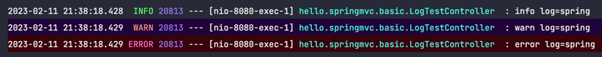

<div align="center">
    <h2>스프링 MVC 1편 - 기본기능 및 실습</h2>
</div>

#### 로깅 간단히 알아보기
- 실무에서는 sout을 사용하지 않고 별도의 로깅 라이브러리를 사용한다.

- 로깅 라이브러리
  - 스프링 부트 라이브러리를 사용하면 스프링 부트 로깅 라이브러리(`sping-boot-starter-logging`)가 함께 포함된다.
  - 이 라이브러리는 기본으로 다음 로깅 라이브러리를 사용한다.
    - SLF4J : 인터페이스
    - Logback :  그 구현체로 Logback을 사용한다.

#### @RestControlelr vs @Controller
- RestController : 컨트롤러에서 문자열을 반환하면 해당 문자열을 HTTP 메시지 바디에 바로 입력한다.
  - `@ResponseBody`와 관련이 있다.
- Controller : 컨트롤러에서 문자열을 반환하면 해당 문자열을 이름으로 갖는 view를 찾아서 view가 렌더링된다.

#### log의 장점
- 로그의 레벨을 지정할 수 있다.


- 프로세스 id, 스레드 id 부터 클래스명 등 많은 내용을 볼 수 있다.
`2023-02-11 21:32:33.308  INFO 20728 --- [nio-8080-exec-1] hello.springmvc.basic.LogTestController  :  info log=spring`
- 로그를 콘솔에 출력도 할 수 있고 `파일`로도 기록을 남길 수 있다.
- sout보다 성능이 좋다(내부 버퍼링, 멀티 쓰레드 등), 로그는 성능이 극한으로 설정되어 있다.
- 모든 로그를 보고 싶은 경우
  - `application.properties`에 로그 레벨을 지정하면 된다.
  - 로그 레벨은 아래와 같은 순서, 상위 등급으로 설정할 수록 하위 등급 로그를 더 볼 수 있다.
  - LEVEL: TRACE > DEBUG > INFO > WARN > ERROR 
  ```groovy
  log.trace("trace log={}", name);
  log.debug("debug log={}", name);  // 현재 로그는 디버그 할 때 보는거야(개발 서버)
  log.info("info log={}", name);  // 운영 시스템에서도 봐야할 중요한 정보
  log.warn("warn log={}", name);  // 경고
  log.error("error log={}", name);
  ```
- 로그 레벨 설정
```groovy
#전체 로그 레벨 설정(기본 info) 
logging.level.root=info

#hello.springmvc 패키지와 그 하위 로그 레벨 설정 
logging.level.hello.springmvc=debug
```
- 운영서버와 개발서버에서 로그의 레벨을 다르게 설정해서 사용을 한다.
  - 설정만으로 로그 출력 모양을 조절할 수 있다는 점도 장점이다. 
  - 그렇게 안하고 sout을 사용하여 출력을 시킨다면 이런 설정이 불가능하다.
  - 개발 서버는 debug 출력
  - 운영 서버는 info 출력
- 올바른 로그 사용법
  - `log.debug("data="+data`
  - 로그 출력 레벨을 info로 하더라도 해당 문자열을 합치는 연산이 발생한다.
  - 즉 출력을 하지도 않는데 문자열을 합치는 연산이 일어나서 메모리가 낭비되는 것이 문제점이다.
  - 따라서 이는 사용은 가능하지만 절대 사용하면 안되는 방법이다.

#### HTTP 요청 - 기본, 헤더 조회
- HttpServletResponse
- HttpMethod : HTTP 메서드를 조회한다. 
- org.springframework.http.HttpMethod Locale : Locale 정보를 조회한다.
- @RequestHeader MultiValueMap<String, String> headerMap
  - 모든 HTTP 헤더를 MultiValueMap 형식으로 조회한다. 
- @RequestHeader("host") String host
  - 특정 HTTP 헤더를 조회한다. 
  - 속성
    - 필수 값 여부: required
    - 기본 값 속성: defaultValue
- @CookieValue(value = "myCookie", required = false) String cookie
  - 특정 쿠키를 조회한다.
  - 속성
    - 필수 값 여부: required 
    - 기본 값: defaultValue

- MultiValueMap 
  - MAP과 유사한데, 하나의 키에 여러 값을 받을 수 있다.
  - HTTP header, HTTP 쿼리 파라미터와 같이 하나의 키에 여러 값을 받을 때 사용한다.
  - keyA=value1 & keyA=value2

- @slf4j
  - 아래 코드를 자동으로 생성해서 로그를 선언해준다.
  ```java
  private static final org.slf4j.Logger log =
  org.slf4j.LoggerFactory.getLogger(RequestHeaderController.class);
  ```
[`@Controller`의 사용 가능한 파라미터 목록](https://docs.spring.io/spring-framework/docs/current/reference/html/web.html#mvc-ann-arguments)
[`@Controller`의 사용 가능한 응답 값 목록](https://docs.spring.io/spring-framework/docs/current/reference/html/web.html#mvc-ann-return-types)

#### HTTP 요청 파라미터 - 쿼리 파라미터, HTML Form
- HTTP 요청 데이터 조회
- 클라이언트에서 서버로 요청 데이터를 전달할 때는 주로 다음 3가지 방법을 사용한다.
- GET - 쿼리 파라미터
  - 메시지 바디 없이 URL의 쿼리 파라미터에 데이터를 포함해서 전달
- POST - HTML Form
  - content-type:application/x-www-form-urlencoded 
  - 메시지 바디에 쿼리 파라미터 형식으로 전달
- HTTP message body에 데이터를 직접 담아서 요청
  - HTTP API에서 주로 사용, JSON, XML, TEXT
  - 데이터 형식은 주로 JSON사용
  - POST, PUT, PATCH

- 요청 파라미터 - 쿼리 파라미터, HTML Form
  - HttpServletRequest의 request.getParameter()를 사용하면 다음 두가지 요청 파라미터를 조회할 수 있다.

#### HTTP 요청 파라미터 - @RequestParam
- 아래와 같이 4가지 방식으로 파라미터를 매개변수로 입력받을 수 있다.
```java
    /**
     * 반환 타입이 없으면서 이렇게 응답에 값을 직접 집어넣으면, view 조회X
     */
    @RequestMapping("/request-param-v1")
    public void requestParamV1(HttpServletRequest request,
                               HttpServletResponse response) throws IOException {
        String username = request.getParameter("username");
        int age = Integer.parseInt(request.getParameter("age"));
        log.info("username={}, age={}", username, age);

        response.getWriter().write("ok");
    }

    @ResponseBody  // ok라는 문자열로 view를 조회하지 않고 그냥 문자열을 http응답에 넣어서 보내버린다.
    @RequestMapping("/request-param-v2")
    // 파라미터 명을 직접 지정한대로 입력받아야 한다.
    public String requestParamV2(@RequestParam("username") String memberName,
                                 @RequestParam("age") int memberAge) {
        log.info("username={}, age={}", memberName, memberAge);
        return "ok";
    }

    @ResponseBody
    @RequestMapping("/request-param-v3")
    // 변수명과 파라미터 명이 동일해야 인식을 할 수 있다.
    public String requestParamV3(@RequestParam String username,
                                 @RequestParam int age) {
        log.info("username={}, age={}", username, age);
        return "ok";
    }

    @ResponseBody
    @RequestMapping("/request-param-v4")
    // 어노테이션을 생략하는 것은 약간 과하다고 생각이 들기도 한다.
    // 팀원들을 위해 어노테이션을 생략하는 것는 조금 지양을 하자
    public String requestParamV4(String username, int age) {
        log.info("username={}, age={}", username, age);
        return "ok";
    }
```
- @RequestPram.required
  - 파라미터 값 필수 여부를 지정할 수 있다.
  - 기본은 true로 설정되어 있다.
- 주의
  - 파라미터 이름만 사용
    - 파라미터 이름만 있고 값이 없는 경우 -> 빈문자로 인식하여 통과된다.
  - 기본형(primitive type)에 null입력
    - null을 int에 입력하는 것은 불가능(500에러)
    - 따라서 null을 받을 수 있는 primitive type으로 지정해줘야 한다.

- 기본 값 적용 - defaultValue
  - 값이 없는 경우 설정한 디폴트 값으로 대체된다.
  - **defaultValue는 빈문자가 와도 기본값으로 대체한다.**

- 파라미터를 Map으로 조회하기 - requestParamMap
  - 모든 파라미터를 Map, MultiValueMap으로 조회할 수 있다.
  - 주의
    - 파라미터 값이 1개가 확실하면 Map을 사용해도 된다.
    - 그렇지 않다면 MultiValueMap을 사용하는 것이 옳다.
      - EX) 키워드 파라미터가 여러개 들어올 수도 있다.
- 